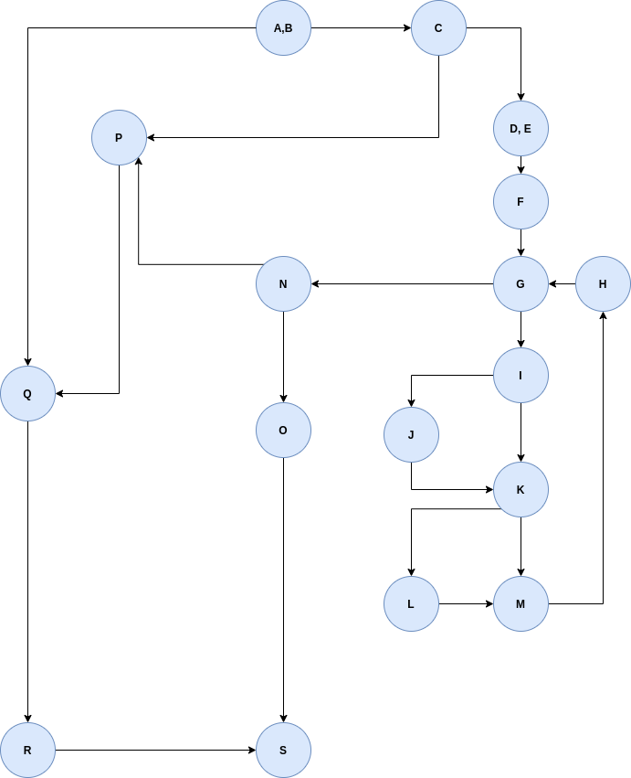
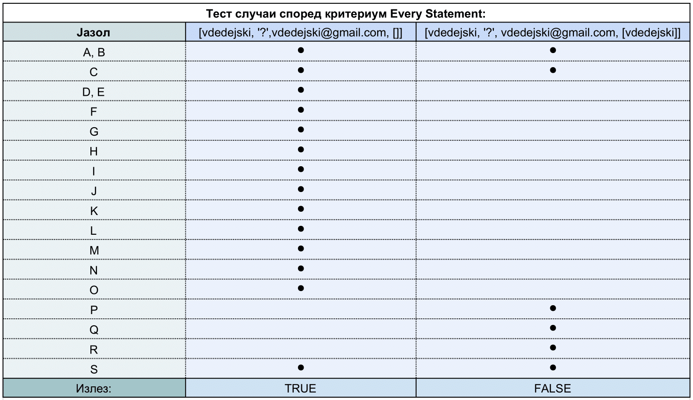
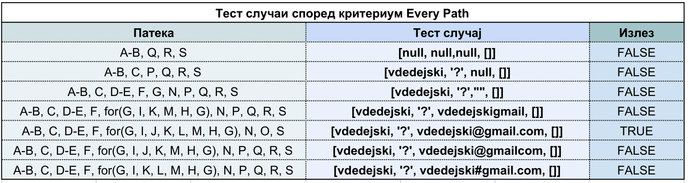

# Втора лабораториска вежба по Софтверско инженерство

## Васил Дедејски, бр. на индекс 186025

### Група на код: 

Ја добив групата на код 1.

###  Control Flow Graph

Фотографија од control flow graph-от

### Цикломатска комплексност

Цикломатската комплесност на овој код е 7. Истата ја добив преку бројот на региони на Control Flow Graph-от, со формулата [број на региони = број на ребра - број на јазли + 2]. Истата комплексност ја потврдив преку формулата [P+1], каде P е бројот на предикантни јазли во графот. 
Број на ребра = 22
Број на јазли = 17
Број на региони = 22 - 17 + 2 = 7
Цикломатска компексност = 7

### Тест случаи според критериумот  Every statement 

Влезот за тестовите е во формат [User.username, User.password, User.email, allUsers].
Oзнаката '?' во влезот означува било што при влез.
Полињата означени со '⚫' покажуваат дека програмата со соодветниот тест пример ќе ја тестира таа наредба во соодветното поле, а празните полиња дека со тој тест пример нема да се тестира наредбата во тоа поле.
Според Еvery Statement критериумот, доволни би биле овие два тест случаи, бидејќи програмта на тој начин, барем еднаш ќе ја тестира секоја наредба во кодот.
(user == null), се смета за исполнет услов при тест случај [null, null, null, '?'], односно само кога (username == null && password == null && email == null).

### Тест случаи според критериумот Every path

Влезот за тестовите е во формат [User.username, User.password, User.email, allUsers].
Oзнаката '?' во влезот означува било што при влез.
(user == null), се смета за исполнет услов при тест случај [null, null, null, '?'], односно само кога (username == null && password == null && email == null).

### Објаснување на напишаните unit tests

**Every Statement тестови**
Методата на тестирање на секоја наредба во кодот е метода која налага да генерираме тест случаеви кои ќе овозможат тестирање на секоја наредба во кодот. Како што е дадено во табелата погоре, со двата тест случаеви се успева да се тестира минимум еднаш секоја нардеба во кодот.
Во првиот тест случај, [vdedejski, '?',vdedejski@gmail.com, []] всушност се тестира програмата со влез кој би дал излез точно, односно ги тестираме јазлите (соодветно се означени погоре во табелата) од Control Flow Графот.
Во вториот тест, [vdedejski, '?', vdedejski@gmail.com, [vdedejski]] даваме несоодветен влез, влез кој ке врати False, за да ги покриеме останатите наредби од кодот кои не успеавме да ги покриеме со првиот тест. Соодветно покриените наредби се погоре во табелата.

**Every Path тестови**
Методата на тестирање на патеките е потемелна метода, односно ги тестира патеките како единстевни секвенци од програмски јазли кои се извршуваат од даден тест случај.
Погоре во табелата се дадени соодветните патеки со тест случаите. 
Во првиот тест случај (user == null) па директно се преминува на јазлите Q, R, S.
Во вториот тест случај  (user.getEmail == null) па тест случајот не може да го помине соодветниот if (C) па преминува на патеката P, Q, R, S.
Во третиот тест случај email адресата е празен стринг. Па според тоа таа не е null но нејзината должина е 0, пак што прави таа да не може да влезе во циклусот for. Според тоа продолжувана по патеката N, P, Q, R, S.
Во останатите тест случаеви од четвртиот до седмиот сите тест случаеви влегуваат во циклус for. Внатре во циклусот имаме двe if наредби, па според тоа имаме четири комбинации на тој излез. Сите тие се опфатени со четирите примери. Само еден од нив го задоволува условот во јазелот (N), и успева да добие излез True.
Со тоа вкупниот број на патишта е 7, што е конзистенто со цикломатската комплексност на Control Flow Graph.
